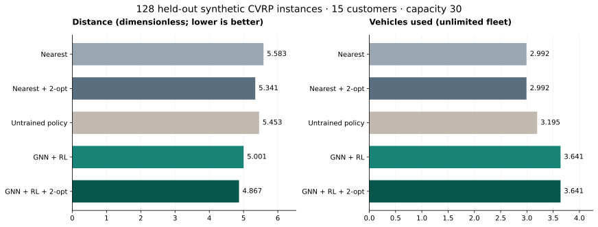
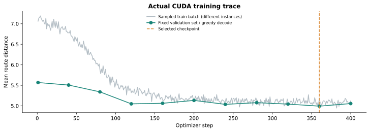

# Logistics AI Lab

**한국어 정책 RAG와 CUDA로 학습한 GNN·강화학습 경로 최적화를 재현하는 물류 AI 실험 프로젝트입니다.**

Python/PyTorch로 실제 학습과 평가를 실행하고, 휴리스틱 기준선·검색 방식·실패 사례를 함께 공개합니다. 기업의 실제 데이터나 운영 시스템은 사용하지 않았습니다. 코드·합성 데이터·문서는 Codex를 활용해 제작했으며, 개인이 직접 구현하거나 이해한 범위를 과장하지 않습니다.

## 실행으로 확인한 내용

| 영역 | 구현과 검증 | 확인된 한계 |
|---|---|---|
| 물류 최적화 | 적재량 제한 CVRP, 최근접·2-opt, GNN + REINFORCE 실제 GPU 학습 | 유클리드 거리·무제한 차량 가정. 도로망·시간창·차량 고정비 없음 |
| RAG | BM25, multilingual E5, RRF Hybrid 비교; 문서 ID·버전·원문 제공 | 16개 가상 문서와 작은 합성 질문 집합 |
| 로컬 LLM | Qwen2.5-1.5B-Instruct CUDA 추론, 생성 원문 보관 | 정책을 반대로 설명하는 실패가 있어 기본은 원문 근거 조회 |
| 서비스 | FastAPI의 요청 검증·오류 응답·학습 체크포인트 추론 | 로컬 실험 API. 인증·실제 운영 배포는 구현 범위 밖 |
| 재현성 | 고정 seed와 모델 revision, 실제 JSON·CSV·학습 곡선, 테스트·CI | 하드웨어/라이브러리가 다르면 수치·시간이 달라질 수 있음 |

## 실제 측정 결과

2026-09-20 KST, Windows / RTX 3060 **8GB** / PyTorch 2.8.0+cu128. 학습 51,200개, 검증 64개, 평가 128개 인스턴스의 seed 구간을 분리했습니다. 고객 15개, 적재량 30, 400 optimizer steps이며 검증 기준으로 360번째 checkpoint를 선택했습니다.

| 경로 알고리즘 | 평균 거리 ↓ | 평균 경로 수 ↓ | 평균 추론 시간 ms | 제약 통과 |
|---|---:|---:|---:|---:|
| 최근접 | 5.583 | 2.992 | 0.369 | 128/128 |
| 최근접 + 2-opt | 5.341 | 2.992 | 0.571 | 128/128 |
| 학습 전 정책 | 5.453 | 3.195 | 44.712 | 128/128 |
| GNN + RL | 5.001 | 3.641 | 44.755 | 128/128 |
| GNN + RL + 2-opt | 4.867 | 3.641 | 44.969 | 128/128 |

GNN + RL은 학습 전 대비 평균 거리 **8.29%**, 최근접 대비 **10.42%** 감소했습니다. **경로 수는 늘었고 추론은 더 느립니다.** 차량 고정비가 없는 목적함수의 결과로, 실제 배송비 절감·속도 향상·최적해 달성으로 해석하지 않습니다. 거리는 km가 아닌 무차원 좌표 거리입니다. [측정 원본](artifacts/routing/metrics.json) · [개별 평가 CSV](artifacts/routing/comparison.csv)



RAG는 답할 수 있는 평가 질문 10개와 답할 수 없는 질문 6개를 사용했습니다. Recall은 필요한 근거 문서 전체 중 검색한 비율의 질문별 평균입니다.

| 검색 방식 | Recall@3 | MRR@3 | 답할 수 없는 질문 보류 |
|---|---:|---:|---:|
| BM25 | 1.00 | 1.00 | 4/6 |
| E5 Dense | 0.95 | 1.00 | 4/6 |
| Hybrid RRF | 1.00 | 1.00 | 4/6 |

이 작은 데이터에서는 Hybrid가 BM25보다 좋아졌다는 증거가 없습니다. **검색 성공률은 답변 정확도가 아닙니다.** Hybrid의 Qwen 초안 12개를 실제 생성했고, 정책 의미를 뒤집는 답변과 인용 누락이 관찰됐습니다. 기본 `generate=false`는 원문 근거만 반환하며 생성 요청 시 `model_draft.verified=false`를 유지합니다. [RAG 원본](artifacts/rag/hybrid/metrics.json) · [실제 질문별 응답](artifacts/rag/hybrid/per_query.json) · [오류 분석](docs/rag_error_analysis.md)

## 빠른 시작 — Windows

Python 3.11~3.13과 Git이 필요합니다. 이 프로젝트에서 확인한 버전은 Python 3.12입니다.

```powershell
git clone https://github.com/TechieMoon/logistics-ai-lab.git
cd logistics-ai-lab
.\scripts\setup.ps1 -Python python
.\.venv\Scripts\python.exe -m pytest -q
.\scripts\serve.ps1
```

브라우저에서 **http://127.0.0.1:8768/docs**를 엽니다. `POST /route`, `POST /ask`에서 **Try it out → Execute**를 누르면 됩니다. 처음에는 학습 가중치나 외부 모델 없이 `two_opt`와 `bm25`를 바로 실행할 수 있습니다.

PowerShell 정책이 스크립트 실행을 막으면 전역 정책을 바꾸지 않고 다음 명령을 각각 실행합니다.

```powershell
python -m venv .venv
.\.venv\Scripts\python.exe -m pip install torch==2.8.0 --index-url https://download.pytorch.org/whl/cu128
.\.venv\Scripts\python.exe -m pip install -r requirements-lock-common.txt
.\.venv\Scripts\python.exe -m pip install -e '.[dev]'
.\.venv\Scripts\python.exe -m uvicorn logistics_ai.api:app --host 127.0.0.1 --port 8768
```

GPU가 없으면 setup에 `-CpuOnly`를 붙이거나 PyTorch index를 `https://download.pytorch.org/whl/cpu`로 바꿉니다. Linux/macOS에서는 `python -m venv .venv` 후 실행 파일을 `.venv/bin/python`으로 바꿔 사용할 수 있습니다. CUDA는 NVIDIA GPU 환경에서만 사용합니다.

## GPU 학습과 RAG 평가 재현

첫 설치에는 수 GB의 PyTorch wheel과 모델 다운로드가 발생합니다. 유료 API 키는 필요하지 않습니다. CUDA 학습과 LLM 생성을 순서대로 실행합니다.

```powershell
# 학습된 정책 생성. 가중치는 저장소에 포함하지 않습니다.
.\.venv\Scripts\python.exe scripts/train_routing.py --device cuda --steps 400 --batch-size 128 --nodes 15 --eval-instances 128

# 동일한 고정 평가셋으로 3개 검색 방식을 비교합니다.
.\.venv\Scripts\python.exe scripts/evaluate_rag.py --retriever bm25
.\.venv\Scripts\python.exe scripts/evaluate_rag.py --retriever dense --device cuda --allow-download
.\.venv\Scripts\python.exe scripts/evaluate_rag.py --retriever hybrid --device cuda --allow-download --generate

.\.venv\Scripts\python.exe scripts/environment_report.py
.\.venv\Scripts\python.exe scripts/plot_results.py
```

`--allow-download`는 최초 모델 준비 때 필요합니다. 준비 후에는 이 옵션 없이 캐시만 사용합니다. 정확한 외부 모델 revision과 라이선스는 [모델·데이터 카드](docs/model_and_data_card.md)에 있습니다. 실제 설치 환경은 [환경 기록](artifacts/environment.json)과 [Windows 전체 버전 기록](requirements-lock-windows.txt)에 남겼습니다.

학습 완료 후 `/route`의 `algorithm`을 `learned` 또는 `learned_two_opt`로 바꾸면 됩니다. API의 경로 추론은 CPU를 사용합니다. 문서 검색 및 초안 생성을 GPU로 시연하려면 `/ask`에서 다음 JSON을 실행합니다.

```json
{"question":"파손 화물을 접수할 때 사진을 몇 장 남기나요?","mode":"hybrid","device":"cuda","generate":true}
```

문서에 없는 내용을 묻거나 실제 회사 규정을 묻는 질문도 시연해 보세요. 답변 보류에는 실패 사례가 있으므로 원문 근거와 초안을 직접 대조해야 합니다.

## 코드와 학습 자료

| 파일 | 읽는 목적 |
|---|---|
| [구조·설계](docs/architecture.md) | RAG와 수치 최적화의 역할 분리 |
| [경로 코드 해설](docs/routing_walkthrough.md) | 그래프 메시지 전달, 제약 마스크, 정책 경사 수식 |
| [10일 학습 계획](docs/learning_plan.md) | 개념 이해 → 코드 추적 → 수정·재실험 |
| [면접 질문·답변 연습](docs/interview_guide.md) | 구현 선택, 실패 설명, 5분 데모 |
| [RAG 오류 분석](docs/rag_error_analysis.md) | 검색 실패와 생성 실패를 구분 |
| [실험 보고서](docs/experiment_results.md) | 측정 결과·한계·후속 실험 |
| [routing.py](src/logistics_ai/routing.py) | 독립 제약 검증기, 기준선, GNN 정책 |
| [rag.py](src/logistics_ai/rag.py) | 검색, 개발셋 보정, 출처와 모델 초안 |
| [api.py](src/logistics_ai/api.py) | 로컬 API와 요청 검증 |



## 기여를 설명하는 원칙

이 저장소를 보유했다는 사실만으로 직접 구현·연구·이해한 경험이 증명되지는 않습니다. Codex 활용을 밝히고, 본인이 실제로 학습·수정·재실험한 내용을 커밋과 실험 노트로 추가하세요. 현재 결과를 실제 기업에서의 운영 성과나 대회 수상 실적으로 표현하지 않습니다.

다음 우선순위는 차량 고정비/차량 상한을 반영한 목적함수, OR-Tools 기준선, 독립 평가 질문, 생성 초안의 근거 일치 검증입니다. 기존 평가 질문을 보고 개선한 경우에는 새로운 별도 평가셋으로 검증해야 합니다.

## 라이선스

프로젝트 코드·합성 데이터: [MIT](LICENSE). 외부 모델은 각 모델 저장소의 라이선스를 따릅니다.
