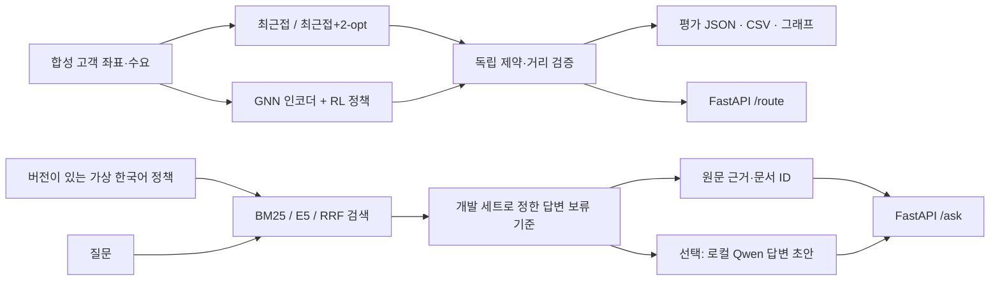

# 구조와 설계 결정

이 프로젝트는 **가상 물류 실험실**이다. RAG가 차량을 배차하거나 경로를 변경하지 않는다. 수치·제약 검증은 Python 최적화 코드에서 처리하고, 문서 질의는 별도의 검색/생성 경로에서 처리한다.

## 경로 문제의 범위

- 단위 정사각형 안의 2차원 좌표, 중앙 차고지, 동일 적재량, 차량 수 제한 없음.
- 각 고객은 정확히 한 번 방문하며 차량은 차고지에서 출발·복귀한다.
- 목적은 유클리드 거리 합 최소화다. 결과 단위는 km·원·분이 아니다.
- 도로망, 교통 정체, 배송 시간창, 기사 근무시간, 분할 배송은 구현하지 않았다.
- 2-opt는 한 차량 경로 안의 방문 순서를 개선한다. 차량 사이 고객 재배정은 수행하지 않는다.

`routing.py`의 검증기는 솔버의 내부 상태를 신뢰하지 않고 결과 경로로부터 거리·적재량·누락·중복을 다시 계산한다. 신경망이 제약 마스크를 사용하더라도 결과 검증을 없애지 않는다.

## 왜 작은 GNN과 REINFORCE인가

노드는 고객/차고지이며 위치·수요 특징을 가진다. 거리 기반 메시지 전달로 주변 노드 정보를 합친 뒤, 현재 위치·잔여 용량·미방문 노드에 따라 다음 행동의 확률을 계산한다. REINFORCE는 실제로 샘플링한 경로의 거리를 이용해 정책을 학습한다. 미분할 수 없는 경로 선택을 직접 미분하는 것이 아니다.

기하학적 거리 prior가 있으므로 학습 모델과 최근접만 비교해서는 학습 효과를 분리하기 어렵다. **학습 전 정책과 학습 후 정책**도 비교한다. 기본 휴리스틱보다 못한 결과도 그대로 보고한다. 신경망 사용 여부가 좋은 배차 품질을 보장하지 않는다.

## RAG 경로

BM25는 가벼운 어휘 검색 기준선이다. Dense 검색은 `intfloat/multilingual-e5-small`로 query/passage 접두사를 구분하고 attention mask를 적용한 평균 pooling과 정규화를 사용한다. Hybrid는 RRF로 검색 순위를 합친다.

답변 보류 기준은 개발 질문으로 선택하고 평가 질문에 고정 적용한다. 이 기준은 작은 합성 질문 집합에 대한 실험이며, 미지 질문 탐지나 환각 방지를 보증하지 않는다. 검색 근거와 생성 초안을 별도 필드로 반환해 검토할 수 있게 한다. 출처가 붙었다는 사실만으로 초안의 모든 문장이 근거와 일치하는 것은 아니다.

## 서비스 및 운영 범위

- `api.py`: 요청 길이·고객 수·용량 검증, 로컬 체크포인트 사용, 모델 호출 직렬화.
- 기본 실행은 `127.0.0.1`에만 바인딩한다. 인증·사용자 격리·분산 처리·공개 서비스 운영은 이 실험 범위 밖이다.
- 모듈 import나 API 요청으로 외부 모델을 자동 다운로드하지 않는다. 평가 스크립트의 `--allow-download`로 명시적으로 준비한다.
- GPU 학습과 LLM 생성을 순차 실행해 8GB VRAM 사용량을 관리한다.
- 학습 데이터, 모델, 실험 결과를 분리한다. 외부 모델 가중치는 Git 저장소에 넣지 않는다.

## 다음에 확장할 실험

1. OR-Tools의 강한 CVRP 기준선과 시간 예산을 맞춘 비교.
2. 분포 이동: 고객 밀집도·수요·고객 수가 달라질 때 품질과 유효성 평가.
3. 실제 도로망 및 시간창은 별도의 데이터와 제약 정의 후 추가.
4. RAG는 사람이 작성한 독립 질문, 문서 개정 충돌, 다중 근거, 악성 문서 지시문을 평가.
5. 생성 초안의 사실 일치성을 사람이 문장별로 평가. 현재 retrieval 점수를 답변 정확도라고 부르지 않는다.
