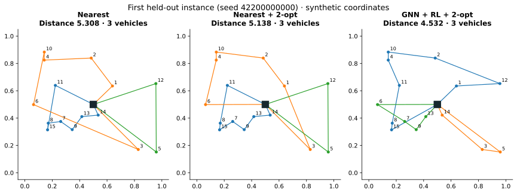

# 실제 실행 보고서 — 2026-09-20 KST

이 문서는 저장된 실행 결과를 요약한다. 합성 데이터로 측정한 학습용 결과이며 기업의 실제 물류 품질·비용·매출 성과가 아니다. 학습은 한 seed에서 한 번 실행했다. 결과를 본 후 같은 평가셋에 맞춰 재학습하거나 임계값을 조정하지 않았다.

## 환경과 다운로드

- GPU: NVIDIA GeForce RTX 3060, 8GB. NVIDIA driver 576.02.
- Python 3.12.14 / PyTorch 2.8.0+cu128 / transformers 4.57.6.
- 프로젝트 전용 `.venv`를 만들고 PyTorch 공식 CUDA 12.8 wheel을 설치했다. 별도 CUDA Toolkit·그래픽 드라이버 설치는 하지 않았다.
- Hugging Face 공식 저장소의 고정 revision에서 E5-small과 Qwen2.5-1.5B-Instruct를 받았다. 모델 가중치는 사용자 컴퓨터의 Hugging Face 캐시에 두며 Git에 넣지 않는다.
- 실제 GPU 텐서 행렬곱의 유한값 검사, GNN/RL 학습, E5 추론, Qwen 생성까지 수행했다.
- [전체 환경 기록](../artifacts/environment.json) · [모델/데이터 카드](model_and_data_card.md).

## 경로 최적화

합성 고객 15개, 중앙 depot, 차량 적재량 30. 좌표 범위는 [0,1]²이고 수요는 1~9다. 거리는 단위 없는 유클리드 거리이며 출발과 차고지 복귀를 포함한다.

| 단계 | 인스턴스 수 | seed 구간 |
|---|---:|---|
| 학습 | 51,200 | 42000000000~42000051199 |
| 검증 | 64 | 42100000000~42100000063 |
| 평가 | 128 | 42200000000~42200000127 |

63,109개 파라미터를 가진 정책을 400 step·batch 128로 학습했다. 실제 학습 시간은 **64.30초**, 128개 평가 실행은 **11.64초**였다. 고정 검증셋에서 가장 낮은 평균 거리를 낸 360 step을 선택했다. 학습 전과 선택 checkpoint의 파라미터 차이 L2는 3.3656이며, 학습 흔적의 보조 증거다. 파라미터 변화 자체가 성능 개선을 증명하는 것은 아니다.

| 방법 | 평균 거리 | 평균 경로 수 | 평균 단일 추론 ms |
|---|---:|---:|---:|
| 최근접 | 5.5826 | 2.9922 | 0.369 |
| 최근접 + 2-opt | 5.3410 | 2.9922 | 0.571 |
| 학습 전 정책 | 5.4533 | 3.1953 | 44.712 |
| 학습된 GNN + REINFORCE | 5.0010 | 3.6406 | 44.755 |
| 학습된 정책 + 2-opt | 4.8670 | 3.6406 | 44.969 |

평가한 모든 방법의 128개 해를 별도 검증기로 확인했다. 고객 누락·중복·적재량 초과·차고지 복귀 오류는 없었다. 이것은 이 평가셋의 결과이며 모든 미래 입력에서의 경험적 보장은 아니다.

평균 거리의 학습 전 대비 감소는 **8.29%**, 최근접 대비 감소는 **10.42%**다. 하지만 차량 수에 해당하는 경로 개수는 늘고 추론 시간도 늘었다. 현재 목적에 차량 고정비나 차량 수 제한이 없으므로 **실제 운영비 개선을 주장할 수 없다**. 비교 표의 신경망 추론은 GPU에서 warm batch-size 1로 측정했고 checkpoint 로딩은 제외했다. API는 CPU에서 정책을 실행하므로 표의 시간을 API 응답시간으로 사용하지 않는다.

브라우저 실시간 시연 seed `20260920`에서는 learned+2-opt 거리가 5.3966으로 최근접 4.9282보다 **9.50% 길었다**. 평균 개선이 모든 사례의 개선을 뜻하지 않는 사례다. 좋은 사례만 골라 성과로 제시하지 않는다.

## 검색과 생성은 따로 평가

가상 정책 16개, 개발 질문 12개, 평가 질문 16개를 사용했다. 평가 중 답할 수 있는 질문은 10개, 답할 수 없는 질문은 6개다. 질문·문서 파일의 SHA-256이 각 metrics.json에 기록돼 있다. 같은 제작 과정에서 작성한 작은 데이터이므로 독립적인 실무 검증이 아니다.

| 방식 | Recall@1 | Recall@3 | MRR@3 | 알고 있는 질문 수락 | 모르는 질문 보류 |
|---|---:|---:|---:|---:|---:|
| BM25 | 0.90 | 1.00 | 1.00 | 10/10 | 4/6 |
| E5 Dense | 0.90 | 0.95 | 1.00 | 10/10 | 4/6 |
| Hybrid RRF | 0.90 | 1.00 | 1.00 | 10/10 | 4/6 |

복수의 관련 문서를 요구하는 질문이 있으므로 첫 관련 문서가 항상 1위(MRR=1)여도 전체 근거 회수율(Recall)은 1보다 작을 수 있다. Hybrid가 BM25보다 개선됐다고 주장하지 않는다. Dense는 다중 근거 사례에서 한 문서를 4위에 놓쳤고 Hybrid가 top-3로 복구했다.

모든 모드에서 문서에 없는 두 질문을 게이트가 잘못 수락했다. 토큰 포함률 threshold만으로 미지 질문을 완벽하게 판정할 수 없었다. 보류 기준은 개발 질문만으로 선택했으며 이 실패를 보고 수정하지 않았다.

평가셋 밖의 실시간 API 점검에서 "냉장 상품은 몇 도로 보관하나요?"도 보류됐다. 문서에 관련 규정이 있어도 짧은 질문의 표현 차이에 토큰 기준이 취약하다. 이 사례는 고정 평가셋 점수에 포함하지 않았으며 threshold를 사후 수정하지 않았다. 기본 데모 질문은 지원되는 파손 접수 질문으로 제공한다.

Hybrid에서 Qwen 초안 12개를 CUDA로 생성했다. 검색 p50 **8.41ms**, 생성 p50 **1,762.91ms**, PyTorch가 기록한 peak allocated GPU 메모리 **3,539.94MiB**였다. 마지막 수치는 드라이버/다른 프로세스를 포함하는 전체 VRAM 사용량이 아니다.

생성 12개 중 인용 문법 검사를 통과한 것은 1개다. 정책을 반대로 해석한 오류가 2개 있었으며 검색 성공을 답변 정확도로 볼 수 없다. [질문별 전체 출력](../artifacts/rag/hybrid/per_query.json)과 [AI 보조 정성 검토](rag_error_analysis.md)를 함께 읽는다. 사람의 독립 정답률 평가를 수행한 것으로 표현하지 않는다.

## 확인 범위와 다음 실험

- 오프라인 단위/API 테스트 24개 통과, 치명적인 구문·정의 오류 대상 Ruff 검사 통과.
- HTTP `/health`, `/results`, 브라우저 Swagger의 실제 learned 경로 실행 확인.
- 테스트 통과는 코드의 검증 대상 동작에 대한 확인이며, LLM 답변의 사실성이나 실물류 성능을 뜻하지 않는다.
- 후속 경로 실험: 차량 고정비·차량 수 제한, OR-Tools 기준선, 여러 학습 seed, 공간/수요 분포 이동.
- 후속 RAG 실험: 새 독립 평가 질문, 근거 일치·부정문 처리 평가, 작은 LLM의 용도 제한, 더 강한 모델과의 자원/품질 비교.
- 현재 평가 결과를 보고 만든 개선은 별도의 새로운 평가셋으로 확인해야 한다.
